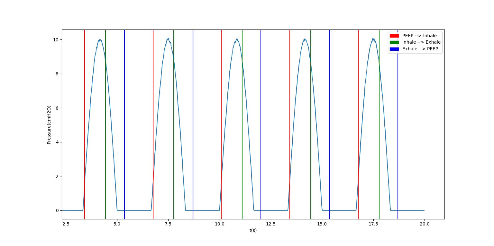

respiration_analysis

In this project we recognize the 3 states of resperation analysis:
Inhale, Exhale, and PEEP.

We base on the following state machine, transitioning by anaylsis of the slope obtained by the linear regression of a sliding window of input pressure samples

Our result:
